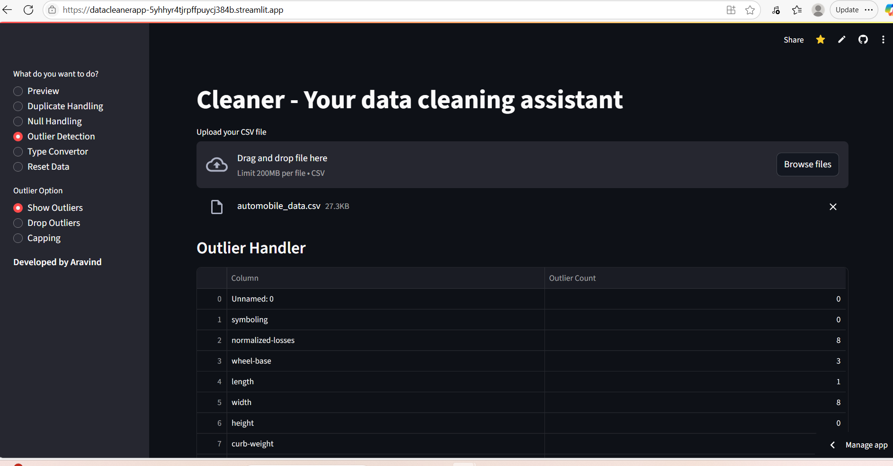

# Cleaner – Interactive Data Cleaning App

Cleaner is a no-code Streamlit app that helps you clean messy CSV datasets with ease. It supports missing value handling, outlier detection, type conversions, basic EDA, and more — all through an intuitive UI.

Live App: [Click here to try it](https://datacleanerapp-5yhhyr4tjrpffpuycj384b.streamlit.app/)  
Sample Data: `sample_data/telco.csv`

---

## Features

- Preview & Summary  
  View top rows, data types, and descriptive stats  
  Display column-wise null percentages

- Null Handling  
  Drop rows or columns with missing values  
  Fill numeric columns (constant or median)  
  Fill categorical columns (most frequent or user input)

- Duplicate & Column Handling  
  Detect and remove duplicate rows  
  Drop selected columns

- EDA Tools  
  Generate histograms, boxplots, and a correlation heatmap

- Outlier Handling  
  Detect using IQR method  
  Drop or cap outliers with data loss preview

- Type Conversion  
  Convert columns to int, float, string, or datetime  
  Preview conversion impact before applying

- Utilities  
  Reset to original uploaded data  
  Download cleaned dataset as CSV

---

## Real Use Case

I used Cleaner to preprocess the [Telco Customer Churn Dataset](https://www.kaggle.com/blastchar/telco-customer-churn):

- Dropped two columns with over 80% nulls
- Converted `TotalCharges` from object to float
- Filled missing values in `tenure` using median
- Capped outliers in `MonthlyCharges` using IQR

Result: A fully cleaned dataset used in a churn prediction model with minimal data loss.

---

## Tech Stack

- Python 3.10
- Streamlit
- Pandas
- NumPy
- Seaborn, Matplotlib

---

## Screenshot



---

## Run Locally

```bash
# Clone the repo
git clone https://github.com/yourusername/cleaner.git
cd cleaner

# Install dependencies
pip install -r requirements.txt

# Run the app
streamlit run cleaner_app.py
```
---

## What I Learned
- Building stateful, dynamic UIs with Streamlit
- Managing real-time user input and validation
- Designing user-safe data operations with rollback options
- Translating repetitive data cleaning tasks into reusable tools

---

---

## License

MIT — feel free to use, fork, or extend this project.

